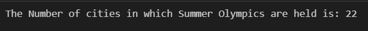
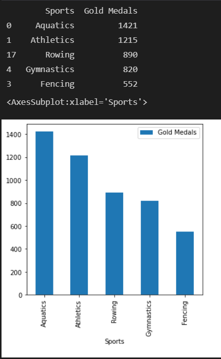

This repository contains the "Summer OLympics DataSet Analysis" Assignment Solution with Codes and Outputs

1. In how many cities Summer Olympics is held so far?

Output:

2. Which sport is having most number of Gold Medals so far? (Top 5)

Output:

